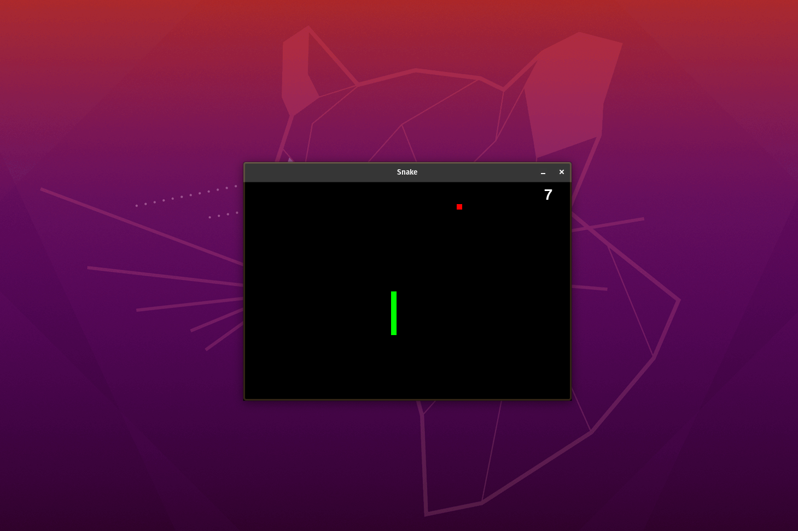

# Snake Game
 Jogo da cobrinha desenvolvida com tutorial no Youtube

## Pré-requisitos

Antes de começar, verifique se você atendeu aos seguintes requisitos:
* Você instalou python 3.
* Você tem uma máquina Windows/Linux/Mac.
* Você leu <a href="https://www.pygame.org/docs/">Documentção do Pygame</a>. (opcional)

## Preparando o ambiente
No terminal ou cmd digite:
```
pip install -r requirements.txt
```

## Iniciando o jogo

Para executar o jogo, siga estas etapas:
Linux e macOS:
```
python3 run_snake.pyw
```

Windows:
```
python run_snake.pyw
```


## Colaboradores

Obrigado às seguintes pessoas que contribuíram para este projeto:

* [@sweydmanaf](https://github.com/sweydmanaf) 📖

## Contato

Se quiser entrar em contato comigo, você pode entrar em contato comigo em `abdulsweyd@gmail.com`.

## Licença
Este projeto usa a seguinte licença: [MIT License](https://opensource.org/licenses/MIT).
